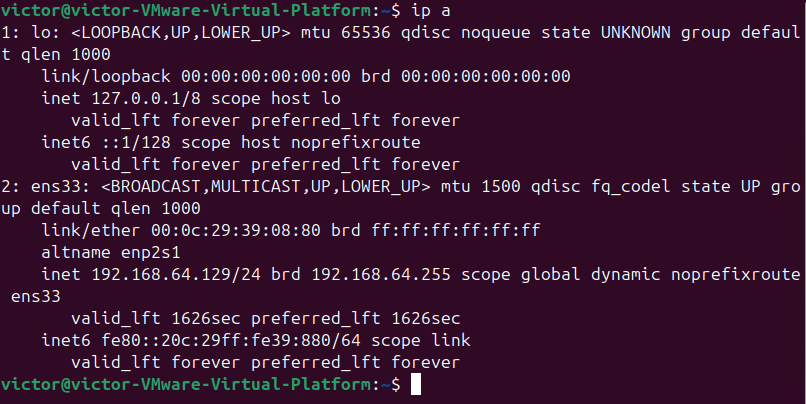
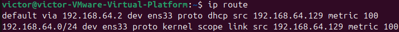
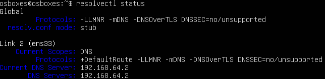
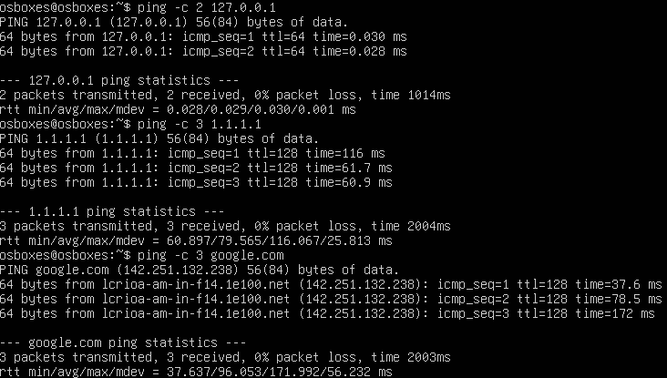

# Etapa 4 – Verificação de Rede e Conectividade

## Contexto da Etapa
Antes da instalação e disponibilização de qualquer serviço de rede, é fundamental garantir que o servidor Linux esteja corretamente conectado à rede, com endereçamento IP válido, rota padrão configurada e serviço de resolução de nomes funcional.

Esta etapa tem como objetivo validar a conectividade do servidor Linux virtualizado, bem como compreender o papel de cada componente da configuração de rede em um ambiente real de infraestrutura.

---

## Objetivos da Etapa
- Identificar as interfaces de rede disponíveis no servidor.
- Verificar o endereçamento IP atribuído ao sistema.
- Analisar a tabela de rotas e o gateway padrão.
- Confirmar a configuração do serviço de DNS.
- Validar a conectividade local e externa por meio de testes práticos.

---

## Identificação das Interfaces de Rede

### Comando utilizado
```bash
ip a
```

## Finalidade
O comando ip a lista todas as interfaces de rede do sistema, exibindo seu estado, endereços IPv4 e IPv6 e informações de camada de enlace.
É o principal comando utilizado em ambientes Linux modernos para diagnóstico inicial de rede.

## Resultado observado
- Interface ativa: ens33
- Estado: UP
- Endereço IPv4: 192.168.64.128/24
- Endereço IPv6 (link-local): fe80::20c:29ff:fe6f:ca14/64
- Método de atribuição: DHCP
- Endereço de broadcast: 192.168.64.255

## Análise
A interface ens33 encontra-se operacional e corretamente configurada, possuindo endereço IPv4 privado obtido dinamicamente por meio do serviço DHCP.
A presença do endereço IPv6 link-local é esperada e indica suporte ao protocolo IPv6 na rede local.

### Evidência da interface de rede



## Análise da Tabela de Rotas e Gateway

### Comando utilizado
```bash
ip route
```

## Finalidade
O comando ip route exibe a tabela de rotas do sistema, permitindo identificar como o tráfego de rede é encaminhado e qual endereço atua como gateway padrão para acesso a redes externas.

## Resultado observado
- Gateway padrão: 192.168.64.2
- Interface utilizada: ens33
- Rede local: 192.168.64.0/24
- Endereço IPv6 (link-local): fe80::20c:29ff:fe6f:ca14/64
- Método de atribuição: DHCP
- Endereço de broadcast: 192.168.64.255

## Análise
A rota padrão aponta para o endereço 192.168.64.2, correspondente ao gateway virtual fornecido pelo modo NAT do VMware.
Essa configuração permite que o servidor acesse redes externas, incluindo a internet, por meio do ambiente de virtualização.

### Evidência da tabela de rotas

)

## Verificação da Configuração de DNS

### Comando utilizado
```bash
resolvectl status
```

## Finalidade
O comando resolvectl status exibe os servidores DNS configurados no sistema, bem como o método de resolução de nomes utilizado.
O DNS é essencial para permitir o acesso a recursos externos por meio de nomes de domínio.

## Resultado observado
- Servidor DNS configurado: 192.168.64.2
- Interface associada: ens33
- Modo de resolução: stub

## Análise
O servidor utiliza o DNS fornecido pelo gateway NAT do VMware, que realiza o encaminhamento das consultas DNS para servidores externos.
A configuração de resolução de nomes encontra-se funcional.

### Evidência da configuração de DNS



## Testes de Conectividade

### Teste 1 – Loopback (Stack TCP/IP Local)

### Comando utilizado
```bash
ping -c 2 127.0.0.1
```

## Resultado
Resposta positiva com 0% de perda de pacotes.

## Análise
Este teste valida o funcionamento da pilha TCP/IP local do sistema operacional, confirmando que a comunicação interna do host está operacional.

### Teste 2 – Conectividade Externa via Endereço IP

### Comando utilizado
```bash
ping -c 3 1.1.1.1
```

## Resultado
Resposta positiva com 0% de perda de pacotes.

## Análise
Este teste confirma o funcionamento do roteamento e do gateway padrão, demonstrando que o servidor possui acesso à internet por endereço IP.

### Teste 3 – Conectividade Externa via Nome de Domínio (DNS)

### Comando utilizado
```bash
ping -c 3 google.com
```

## Resultado
Resposta positiva, com resolução do domínio para o endereço IP 142.251.132.238.

### Evidência dos testes de conectividade



## Análise
Este teste confirma o funcionamento correto do serviço de DNS, validando a capacidade do servidor de resolver nomes de domínio e se comunicar com hosts externos.

## Conclusão da Etapa
Com base nas verificações realizadas, o servidor Linux virtualizado apresenta conectividade completa, incluindo:
- Interface de rede ativa e funcional.
- Endereçamento IP válido atribuído via DHCP.
- Gateway padrão corretamente configurado.
- Serviço de DNS operacional.
- Comunicação local e externa validada por testes práticos.

Dessa forma, o ambiente encontra-se preparado para a instalação e configuração de serviços de rede nas próximas etapas do projeto.

